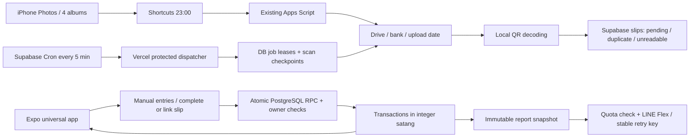

# Architecture and decisions

## Ownership and security

JWT is verified with Supabase Auth before every private API request. Server reads/writes explicitly scope owner_id. Composite foreign keys prevent linking another owner's account/category/slip, even when server uses the service role. Transactions and slip links use authenticated SQL RPCs with `auth.uid()` checks and row locks. Clients cannot call job/LINE/service-only procedures. All personal tables have RLS; secret integration tables have no authenticated client policy.

Private images are downloaded with service-account read-only scope on the server and returned as bounded JPEG after ownership check. They use no public Drive URLs and no browser service-worker cache. Secrets are never included in Expo env or responses. LINE uses the original request body for signature verification; pairing codes are random, hashed, short-lived and single-use.

The v1 service account is bound to `DRIVE_OWNER_ID`. Source configuration, image access and worker downloads reject other owners, so an authenticated second user cannot reuse the primary owner's folder IDs to import private slips. Future multiuser Drive integration requires separately provisioned credentials/authorized source mappings, not just more owner_id rows.

## Durable work

Supabase Cron dispatches every 5 minutes. Only due scan/report work is enqueued. A six-minute global lease serializes overlapping ticks beyond Vercel's maximum function duration; four-minute per-job leases recover crashes. Each claim has a token; completion only updates a matching lease. Dispatcher uses a 205-second budget, leaves at least 30 seconds before starting another task and checkpoints scan pages, rechecking remaining time between files. Supabase requests have 15-second timeouts. Work never depends on a process running after the HTTP response.

Scan traverses bank folders recursively using paginated folder listings. It maintains a persisted queue/page token and discovers date subfolders without assuming transaction date. File ID upserts are idempotent; even existing slip rows get the same QR job key, recovering insert-before-enqueue crashes. Subsequent scans list folders for new files but do not process completed images again. One source changed while a scan is running can briefly yield old-source metadata; retrying scan discovers the configured source. Personal volume is the initial target.

Import is bounded to JPEG/PNG/WebP, 12 MB, 24 million input pixels; decoding tries two scales. Hashes identify identical files. Only CRC-valid Mini-QR references identify re-encoded copies; unknown QR payload equality alone never merges different images. Duplication is serialized per owner in SQL and backed by unique canonical indices. No unsupported QR format creates a transaction. No financial values are inferred from upload date, filenames, payment request QR or screenshots.

Job failures retry with exponential delays capped at 60 minutes, then become failed after five actual failures. Partial scan checkpoints do not consume the error retry budget. Exhausted crashed jobs become failed when claimed in the next dispatcher cycle. User retry is available for failed/unreadable slips. Successful scans with no new slips remain distinct from failed scans.

## Reporting

Amounts are integer satang; times are stored as UTC and report boundaries computed in Asia/Bangkok. Transfers count in the transaction list, but not income/expense/net/category totals. Account charts show cash flow, not balances.

Daily transaction range ends exclusively at 23:00; pending count uses the full upload calendar day so nightly uploads after 23:00 are visible. Weekly/monthly ranges include complete calendar periods. The daily LINE report is a cutoff snapshot; dashboard and in-app reports use latest entries/full day. Snapshot retry never recomputes or resends after manual corrections. UUID retry keys cover LINE's 24-hour window; uncertain older deliveries stop automatically. Database uniqueness on owner/report_key prevents another report record for the same period.

## API

All private endpoints require `Authorization: Bearer <Supabase access token>`.

| Endpoint | Purpose |
|---|---|
| GET `/api/data` | Initial owner dataset, paginated DB reads |
| GET `/api/transactions` | UTC start/end, account/category, page/size |
| PUT/DELETE `/api/transactions/:uuid` | Validated owner mutation, client UUID for retry |
| GET `/api/dashboard?start=...&end=...` | Summary |
| POST `/api/slips/:uuid/link` | Atomic link to existing transaction |
| GET `/api/slips/:uuid/image` | Private bounded image |
| POST `/api/slips/:uuid/retry` | Reset a QR job |
| POST `/api/sync` | Queue source scan |
| PUT `/api/sources/:code` | Folder + actual-account mapping |
| POST `/api/accounts`, `/categories`, `/rules` | Configuration |
| PATCH `/api/settings` | Monthly budget |
| POST `/api/line/link-code` | Pairing command, valid five minutes |
| DELETE `/api/line/connection` | Disconnect owner |
| GET `/api/export?start=...&end=...` | Formula-escaped owner-only CSV |
| POST `/api/internal/tick` | CRON_SECRET, service-only dispatcher |
| POST `/api/line/webhook` | HMAC-verified LINE events |

## Deployment boundary

Code, migrations, adapter and Cloud schedule are delivered. Real cloud accounts, credentials, real bank-slip fixtures and phone devices are not available in this implementation session; no cloud deployment or actual LINE push has been performed. Self-signup is deliberately absent. Native store distribution and multiuser service provisioning are later work.
